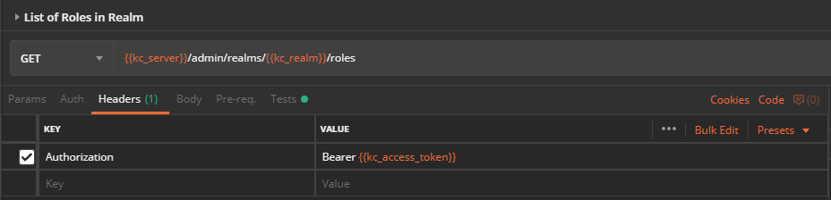
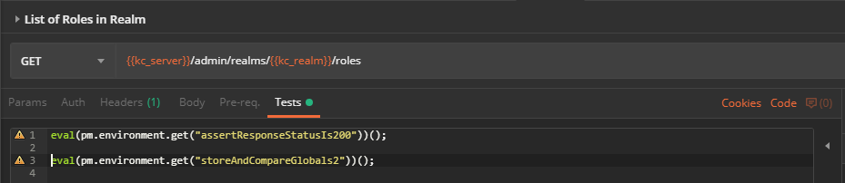
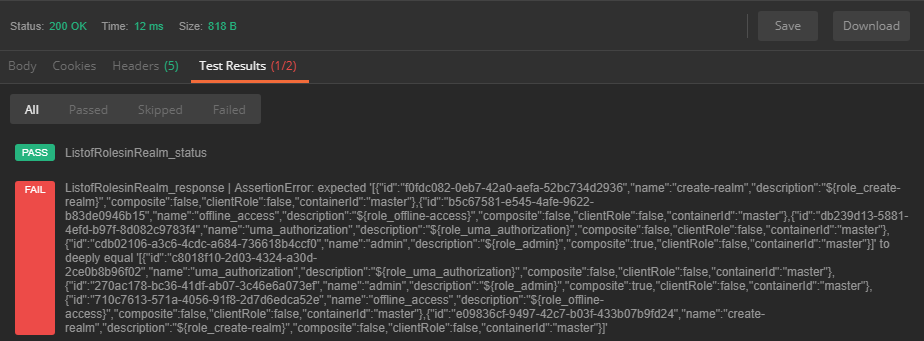
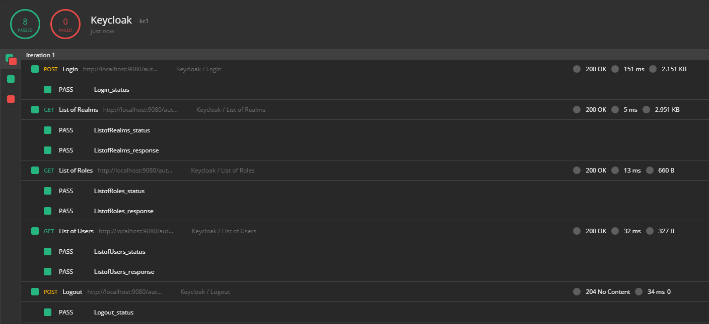
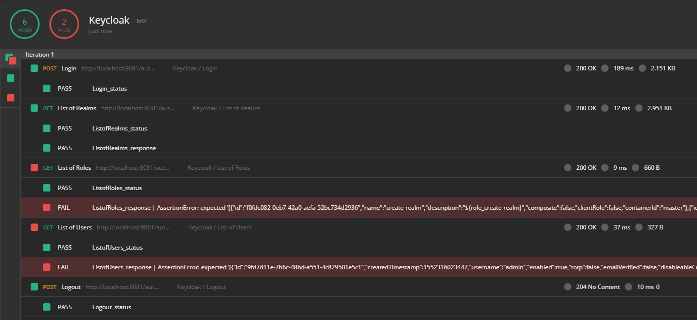

# Postman_same-response-as_keycloak
## Using Postman to assert actual against expected Json responses
#### applied on the Admin API of a Keycloak authentication server

***
*This repository in a series of similar repositories for API testing intended for a specific workflow that compares expected against actual API responses*

### (I) The problem

The following are typical workflows for API development and testing

* **Regression testing of an existing API or backend**
* **Development of a new API**
* **Integration testing at API-level**

For more details about the problem please go to repository [`restassured_same-response-as_keycloak`](https://github.com/raketensilo/restassured_same-response-as_keycloak)

### (II) A solution attempt with Postman

Using
* `Postman` popular and well-known REST-API GUI client
* testing it on the `Keycloak Admin API` of a Keycloak Authentication Server that runs inside a `Docker` container

Versions used (other versions may differ)
* Postman v7.0.5
* Keycloak 4.3.0.Final

### (III) How to get started
#### 1. Download this repository
* Use git or your browser to download this repository to your platform

#### 2. Download and install Postman
* Download the app `Postman v7.0.5` or higher from [https://www.getpostman.com/downloads/](https://www.getpostman.com/downloads/)
* Install Postman on your system

#### 3. Import Collections and Environments
* Import the collections included in the repository go to `File > Import > Import Folder > Choose Folders` and choose the `collections` folder. If successful you will see 4 collections on the left side in Postman main window inside the `Collections` tab.
* Same with Environments. Import the environment included in this repository by going to `File > Import > Import Folder > Choose Folders` and choose the `environments` folder. After completion click on the gear symbol in the upper-right corner in Postman. If successful you will find 2 new environments in the `Manage Environments` window.
%%%%% GIF %%%%%

#### 4. Use Docker to start 2 Keycloak serverw
* make sure you have `docker` installed
* go into the `docker` subfolder of this repository and run `docker-compose up` to start 2 docker containers each containing a keycloak server

### (IV) Usage instructions
#### 1. Test example

#### 2. Run collection against kc1 (Keycloak 1) to record expected responses

#### 3. Re-run collection against kc2 to compare actual and expected response

